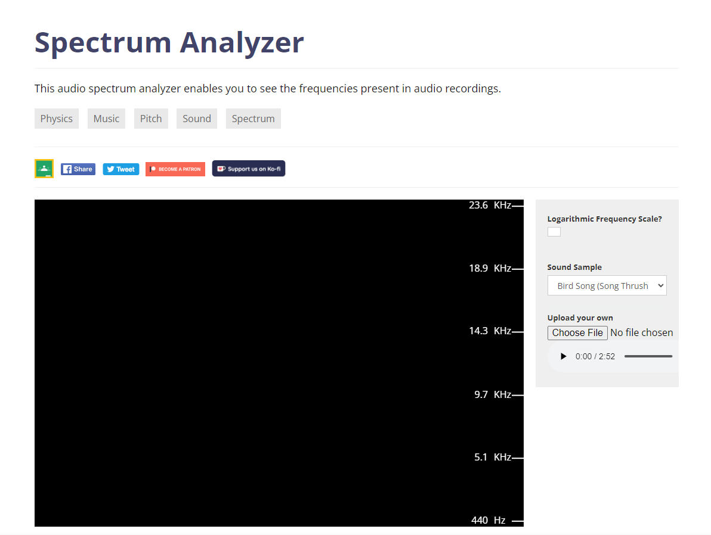

## Hiding Messages with Sound Spectrums

Steganography in wave sounds involves embedding secret messages within audio files without noticeable changes to the sound. This technique is utilized in various applications, including secure communications and digital watermarking. By manipulating specific characteristics of sound waves, such as amplitude and frequency, data can be hidden in a manner that is imperceptible to human ears.

## Tools for Analyzing Sound Spectrums

To analyze sound spectrums and understand how data can be hidden within audio files, tools like spectrum analyzers are essential. These tools provide visual representations of sound waves, helping users observe changes in frequency and amplitude that may indicate hidden messages. One such tool is the **[Academo Spectrum Analyzer](https://academo.org/demos/spectrum-analyzer/)**.

### **Academo Spectrum Analyzer**

The Academo Spectrum Analyzer is an online tool that allows you to visualize sound waves in real time. It converts the sound into a frequency spectrum, showing the distribution of audio frequencies and their respective amplitudes.

#### Key Features:

- **Real-time Sound Analysis**: You can view the frequency spectrum of live audio input, such as from your microphone, or analyze pre-recorded audio files.
- **Visual Representation**: The tool creates a graph with frequency on the x-axis and amplitude on the y-axis, enabling detailed observation of how sound is distributed across the spectrum.
- **Frequency Range**: The spectrum analyzer covers a wide range of frequencies, from low bass sounds to high treble, allowing you to detect even the smallest variations in the audio signal.

## Use Cases for Audio Steganography

- **Secure Communication**: Audio steganography can be used for covert communication, embedding secret messages within ordinary sound files to avoid detection.
  
- **Digital Watermarking**: Audio watermarking embeds copyright information into sound files to protect intellectual property and verify ownership.
  
- **Data Integrity Verification**: Audio steganography techniques can be employed to embed hash values or checksums within a sound file, enabling verification of data integrity without altering the file content.

## Conclusion

Sound spectrum steganography is a powerful tool for embedding secret messages within audio files. While these methods are generally undetectable by human hearing, specialized tools can reveal hidden messages for those who know where to look.