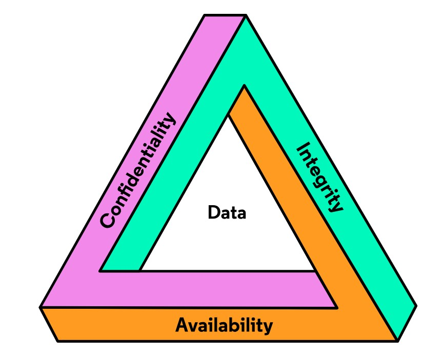
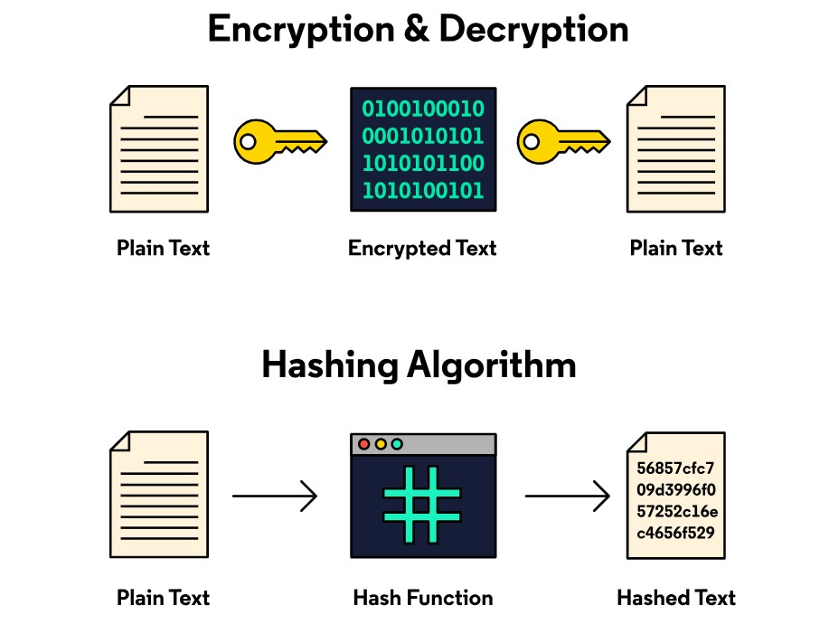

# Welcome to the Fundamentals of Cybersecurity Skill Path 🚩

#### Start your Cybersecurity journey by learning key fundamentals.

# CIA Triad

When looking at security vulnerabilities, it’s important to understand the CIA Triad.

What we’ll be learning
Cybersecurity practitioners are expected to demonstrate a security-focused mindset that incorporates conceptual security practices, as well as an understanding of security technologies. It is important to understand fundamental Cybersecurity concepts and terminology. 

## The CIA triad
Cybersecurity practitioners are expected to be familiar with fundamental security management principles and concepts. The CIA Triad simplifies the primary goals and objectives of Cybersecurity for policy writers, system architects, and security practitioners. The CIA Triad, and its principles, define the overall goals and objectives of security implementations and practices in Cybersecurity. Using the CIA Triad as guidelines for anything Cybersecurity-related is a good practice.

The CIA Triad contains the three primary principles in Cybersecurity:

- Confidentiality
- Integrity
- Availability

The CIA Triad is used to evaluate the risks and vulnerabilities of an organization based on the threat these may pose to any of the three principles. Organizations should ensure the three principles captured in the CIA Triad are addressed in their Cybersecurity governance, practice, and in technical implementations.

# Confidentiality   

**Definition:** Preserving safeguards, access controls, and disclosures of sensitive data to ensure privacy (aka confidentiality) of personal and proprietary information from unintended parties.

**Simplified Concept: **Only authorized individuals, processes, and systems that should have access to information can access it.

A tenet of Cybersecurity and information security is the achievement of the complete confidentiality of data. For confidentiality to be successful, the data and information must be secured from unauthorized disclosure, access, or use while:

- **In storage** (Think: data-at-rest):

Information stored in any form of storage must remain secured and confidential. This includes local hard disk drives (HDD), solid-state disks (SSD), flash drives (USB thumb drives, SD cards, etc.), compact disks (CD, Blu-Ray, etc.), floppy disks (rare, but to note), and in the cloud.

- **In process** (Think: system processes active in CPU and RAM):

This includes any information being actively processed by a processing unit or placed in volatile memory (RAM, buffers, and cache memory). The data stored in the process is susceptible to theft from malware or buffer overflow attacks on a computing device, therefore it must be ensured that this data and information remains confidential.

- **Traversing a network** (Think: in transit):

Hypertext Transfer Protocol Secure, or HTTPS, protocol uses encryption to maintain the confidentiality of data traveling from one network to another. Remove the “S” from “HTTPS” and you get “HTTP”. The communication established with HTTP travels between networks in plaintext. The encryption applied by HTTPS guards data and information against unauthorized prying eyes, maintaining the confidentiality of the communications. Confidentiality must be maintained while data travels across networks!

To protect information from unauthorized disclosure, access, or theft, access control methodologies are applied to an organization’s information security practices. One key concept is the principle of least privilege. The principle of least privilege states that access to data/information should be restricted to ONLY the resources absolutely necessary to perform a job function. In other words, users, accounts, and computing processes should only have the minimum authorized permissions necessary to perform routines and authorized job roles.

Encryption is a key technology that contributes to securing data and information from unauthorized access. Encryption techniques such as file/disk encryption and encrypted communications are effective in maintaining the confidentiality of data and information.

# Integrity
**Definition:** Guarding data/information, in transit or at rest, from unauthorized destruction or modification so that it remains in the state intended by the owner(s) upon receipt or submission. Ensuring the data/information is authentic and proven to be received from the true origin of the data/information (non-repudiation).

**Simplified Concept:** Data is what we expect it to be.

In computing, the integrity of data/information means ensuring data is authentic, accurate, and is free from unauthorized modification. In information security, if a security mechanism ensures integrity, then we can be sure that data/information is unaltered and in its original state. Similar to confidentiality, integrity must be ensured at rest, in process, and in transit.

One of the most basic methods for confirming the integrity of digital assets is cryptographic hashing. In hashing, data is processed through a hash function which produces a unique hash value. That hash value is now similar to a “certificate of authenticity” since the data will always produce the same hash value if processed through the same hash function.

Integrity is also vital in ensuring the authenticity of data origins. A concept known as non-repudiation is a combination of authenticity and integrity. It ensures that we know who authored transmitted communications and data, and that this user or entity can’t deny they did the action.

# Availability
**Definition:** Ensuring that access to information, and the networked services that host the information, are accessible in a reliable and timely manner by users at all times.

**Simplified Concept:** Data is available when it should be.

Perhaps the simplest concept of the CIA Triad is the tenet of **availability**. Availability means that information of an individual or organization must be accessible to them when they need it. Denying access to data and information is a common security threat in Cybersecurity, therefore Cybersecurity practitioners must incorporate availability into the Cybersecurity mindset. For example, Denial-of-Service (DoS) attacks are designed to overwhelm or crash networked or local services so that data and information are inaccessible. While external DoS attacks are a real threat, loss of availability is often caused by accidental hardware failures, software bugs/errors, or environmental concerns. In our Cybersecurity mindset, we should be able to implement infrastructure safeguards and be able to identify possible obstructions of data availability.

Availability is mandatory for networked resources such as databases, web applications, websites, etc. When it comes to networked services, performance, redundancy, backups, and data loss prevention are essential in ensuring availability.

## Prerequisites
