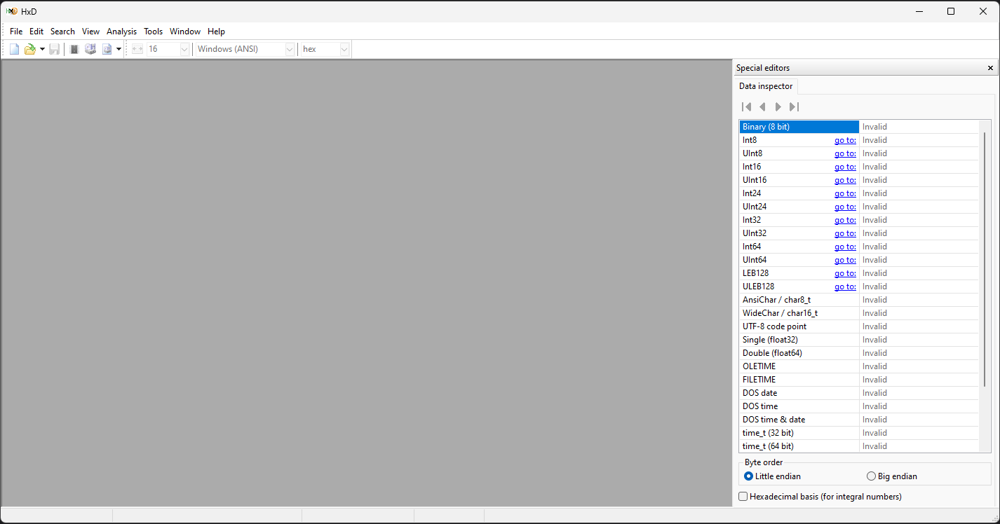

## Introduction to Hexadecimal File Inspection

When working with binary files, inspecting the raw contents in hexadecimal format can offer detailed insight into the file's structure. Tools like `hxD`, `xxd`, and `hexedit` allow users to view files as hexadecimals, which are often used in forensics, reverse engineering, debugging, and data analysis. This module will guide you through reading and understanding binary files as hexadecimal.

### Viewing Binary Files in Hexadecimal

#### Using `HxD`

`HxD` is a popular GUI tool for inspecting binary files in hexadecimal format. It presents a visual representation of a file in both hexadecimal and ASCII side by side, making it easier to decipher the raw data and spot patterns.



#### Using `xxd`

`xxd` is another command-line tool commonly used to create hexadecimal dumps of binary files. It produces output with both the hexadecimal view of the file’s content and the ASCII interpretation.

To view a binary file as hexadecimal with `xxd`:

```bash
xxd file.bin
```

### Understanding Hexadecimal Dumps

A typical hexadecimal dump consists of three parts:
1. **Offset**: The starting address or position of the byte in the file.
2. **Hexadecimal Representation**: The raw bytes, displayed as pairs of hex digits.
3. **ASCII Interpretation**: If the byte values correspond to printable ASCII characters, they will be displayed on the right.

For example:

```
0000000 48 65 6c 6c 6f 20 77 6f 72 6c 64 21 0a 00 00 00 0000010
```

In this example:
- The **offset** starts at `0000000`.
- The **hexadecimal values** are `48 65 6c 6c 6f`, which convert to ASCII as "Hello".
- The **ASCII view** on the right shows the readable text: `Hello world!`.

### File Headers and Magic Numbers

Many binary files begin with a header that helps identify the file type. This header is often called the *magic number* because it’s used by programs to identify the file format.

Some common examples include:

#### PNG Files

```
89 50 4e 47 0d 0a 1a 0a
```

- `89 50 4e 47` represents the ASCII string `PNG`.
- This is followed by special bytes (`0d 0a 1a 0a`), which define the file type.

#### JPEG Files

```
ff d8 ff e0
```

- `FF D8` is the start of the image data.
- `FF E0` indicates an application segment.

#### PDF Files

```
25 50 44 46 2d 31 2e
```

- `25 50 44 46` corresponds to the ASCII string `%PDF`.
- The version of the PDF file follows (`-1.` for PDF-1.x).

#### ZIP Files

```
50 4b 03 04
```

- `50 4b` corresponds to the ASCII characters `PK` (used by PKZIP file formats).
- `03 04` signifies a central directory header.

#### ELF Files (Executable and Linkable Format)

```
7f 45 4c 46
```

- `7f 45 4c 46` is the ELF magic number, `7f` followed by the ASCII string `ELF`.

### Practical Applications

1. **Reverse Engineering**: Analyzing binary files and their headers can help determine how the file works and whether it's executable or contains embedded code.
2. **Identifying File Types**: Recognizing the magic number in a file’s header allows quick identification of the file type, which is useful when files lack extensions or when examining unknown files.
3. **Data Recovery**: Understanding file structure at the byte level can be helpful when trying to recover data from damaged files or corrupted formats.
4. **Forensic Analysis**: Security professionals and digital forensics experts often use tools like `hxD`, `xxd`, and `hexedit` to inspect files in hexadecimal to find hidden or embedded information.

### Conclusion

Reading binary files as hexadecimal is a powerful technique for anyone working with low-level file analysis. Understanding file headers and magic numbers helps in determining the file format, and inspecting the data at a byte level can lead to valuable insights, especially in reverse engineering, forensics, or debugging scenarios.
